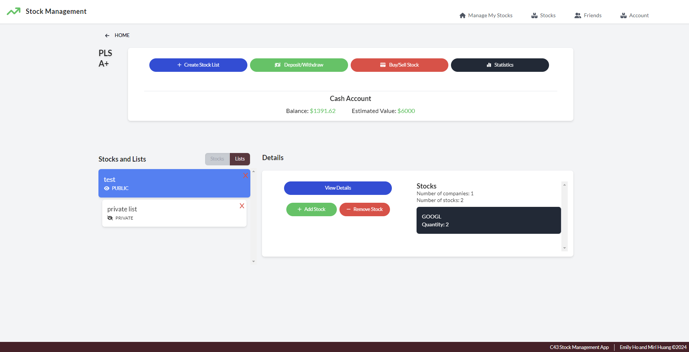

# Stock-Management-App
Elevate your stock trading experience with this innovative app that lets you explore and track a variety of stocks, build personalized portfolios and stocklists, and execute seamless transactions. You can dive deeper into market analytics with advanced covariance and correlation tools, follow and connect with friends, and share insights by writing reviews on your friends' stocklists. The app also harnesses predictive algorithms to forecast future stock prices, visualizing trends with dynamic graphs for different companies.

## Tech Stack
- Java and SpringBoot in the backend to run REST APIs and SQL queries
- PostgreSQL and SQL for the database
- React.js and Tailwind.css in the frontend
- GCP (Google Cloud Platform) to host the app in a VM

## Starting the App in the GCP VM
- Start the VM
- Open SSH and type the following to start postgres in the VM:
    - `cd /data/postgres`
    - `sudo su postgres`
    - `bash`
    - `source ~/.bash_profile`
    - `pg_ctl start`

## Running the App in the Backend
Go to the directory:
`cd stocks_api`

Install Maven and its dependencies:
`mvn install`

Run Spring Boot:
`mvn spring-boot:run`

To clean anything if the run doesn't work:
`mvn clean`

## Running the App in the Frontend
Go to the directory:
`cd frontend`

Install dependencies:
`npm install`

Run the App:
`npm run dev`

# Here are some images of the project
Google Stock Graph:

Portfolio Page:

Covariance and Correlation Calculation:
